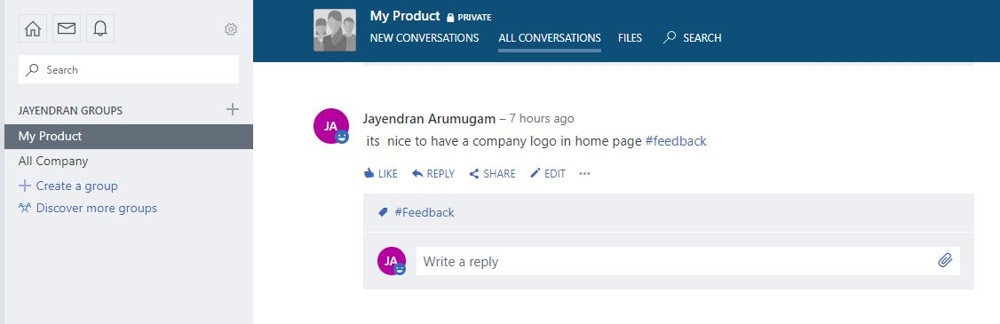

# Serverless Prediction of a Product Feedback (#AzureDevStories)

## Architecture Diagram

## Components Used

- Yammer
- LUIS
- Logic Apps
- AzureDevOps WorkItems
- Cosmos DB
- Signal R
- Azure Functions

### Yammer 

Users provide their feedback about the product. It could be many, for the demo purpose I just choose 2 topics *(Bug, Feature)*

 

 

 

### LUIS

Creating Intents for Bugs and Feedbacks in the LUIS.

### Logic Apps

Predicting the Intents i.e, Bug or Feedback based on the Yammer Post by the user and take necessary actions

### AzureDevOps WorkItems

Create Bug/Feature if the top intent of the Post matched with LUIS 

### Cosmos DB

Insert the document in Cosmos DB if the top intent of the Post is *None*

### Signal R

Serverless Signal R used to autorefresh the WebPage for the Live updates of the *None* intent

### AzureFunction

Azure Function Integrated with Cosmos Change feed and provide live Updates in the static Web Page with the help of Signal R.

Static WebPage with Live CosmosDB Feed for *None* intent which helps the developers to take necessary action like *re-train the LUIS model with additional utterances* or *create new intents/entites*

